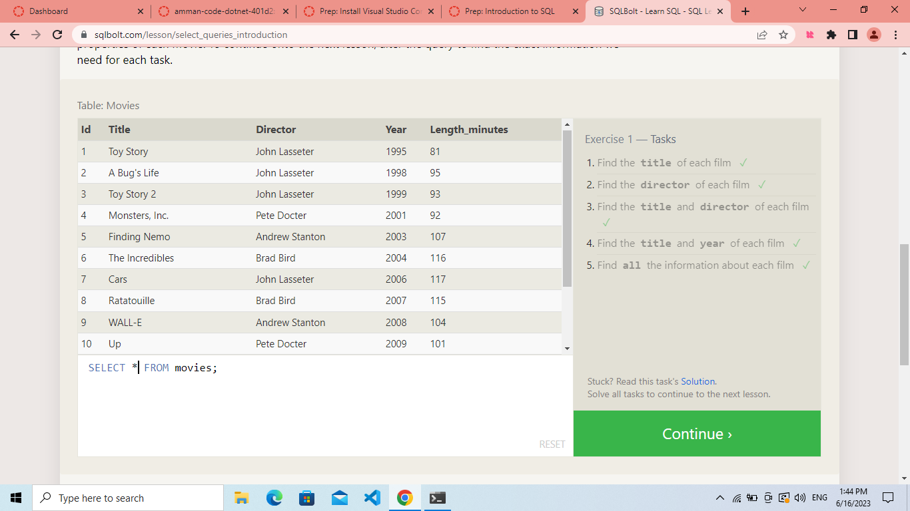
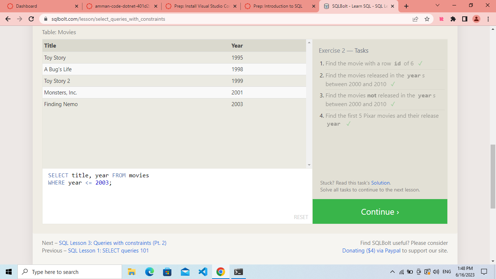
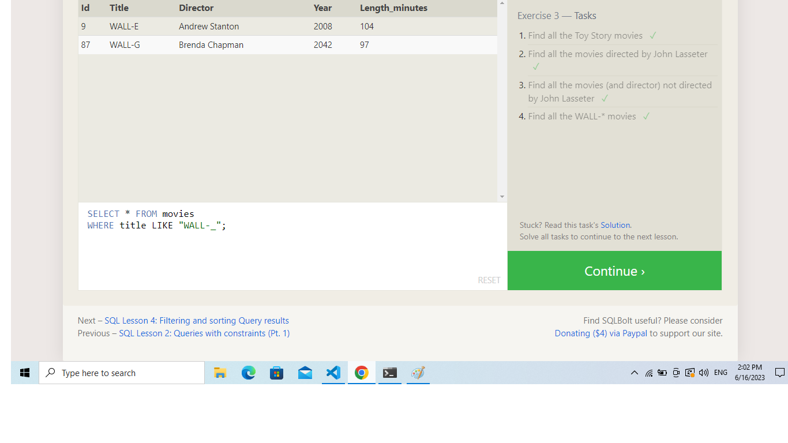

# SQL

Relational databases are a type of database management system (DBMS) that organizes and stores data in a structured manner, using tables composed of rows and columns. The relationship between these tables is defined through keys, which establish connections between the data.

Structured Query Language (SQL) is a standard programming language used to manage and manipulate relational databases. It allows users to create, modify, and retrieve data from the database using various commands and statements. SQL provides a declarative approach, meaning that users specify what they want to achieve without having to specify the exact steps to get there.

Some key concepts in relational databases and SQL include:

Tables: Data is stored in tables, which consist of rows (also called records or tuples) and columns (also called attributes). Each table represents a specific entity or concept.

Primary Key: A primary key uniquely identifies each row in a table. It ensures data integrity and is often used to establish relationships with other tables.

Foreign Key: A foreign key is a column in one table that refers to the primary key in another table. It establishes relationships between tables and maintains data integrity.

Queries: SQL allows users to write queries to retrieve specific data from one or more tables. Common query types include SELECT (retrieving data), INSERT (inserting new data), UPDATE (modifying existing data), and DELETE (removing data).

Joins: Joins combine rows from multiple tables based on a related column between them. Common join types include INNER JOIN (returns matching rows), LEFT JOIN (returns all rows from the left table and matching rows from the right table), and RIGHT JOIN (vice versa).

Indexes: Indexes improve the performance of database operations by creating a data structure that allows for quicker data retrieval. They are typically created on columns frequently used in search conditions.

Transactions: A transaction is a sequence of database operations treated as a single unit. It ensures that all operations within the transaction are completed successfully, or none of them are applied, maintaining data consistency.

Relational databases and SQL provide a powerful and flexible way to store and manage structured data. They are widely used in various applications, ranging from small-scale projects to large enterprise systems.

## SOME SQL IMPORTANT COMMANDS

1. SELECT column, another_column, …
FROM mytable;

2. SELECT column, another_column, …
FROM mytable
WHERE condition
    AND/OR another_condition
    AND/OR …;

3. SELECT column, another_column, …
FROM mytable
WHERE condition
    AND/OR another_condition
    AND/OR …;

    